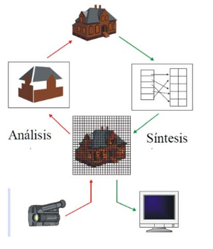

# 1. Introducción a los Sistemas Gráficos
---
## 1.1 ¿Qué es un Sistema Gráfico?
>A grosso modo, sería un sistema formado para representar imágenes con ámbitos como juegos, películas, animaciones... Trata de hacer entender los datos más fácilmente a través de imágenes. También puede sintetizarse esas imágenes procesando otras.

**Sistema**: Conjunto de reglas o principios sobre una materia racionalmente enlazados entre sí.También puede ser conjunto de cosas que relacionadas entre sí ordenadamente contribuyen a determinado objeto.
**Sistema informático**: Sistema orientado a almacenar y procesar información cuyos componentes relacionados entre sí son: hardware, software y recursos humanos
**Sistema informático gráfico**: Sistema informático en el que la generación de información gráfica ocupa un papel fundamental.

## 1.2 Disciplinas de los Sistemas Gráficos
**Modelado**: Trata de construir una representación en 3D de una entidad a partir de un conjunto de datos y especificaciones matemáticas de las figuras.
**Síntesis de imágenes (o *rendering*)**: Trata de obtener, a partir del modelo, junto con luces, materiales, colores, posición de la cámara, etc... una imagen. Destaca en el fotorrealismo.
**Animación**: Trata de transmitir al usuario la ilusión de que algo en la escena que está observando cambia a lo largo del tiempo. Usa el modelado y el renderizado; además de añadir el movimiento al paso del tiempo.
**Realidad Virtual**: A través de modelos y simulaciones por computadora, se quiere inmersar al usuario en un mundo tridimensional.
**Interacción**: Trata cómo hacer que el usuario conecte con una aplicación de forma amigable y dinámica
**Visualización**: Trata de representar los datos numéricos muy complejos a través de una imagen visual. Se usa, por ejemplo, en simuladores.

## 1.3 Síntesis vs Análisis.
**Análisis**:Proceso de extracción de información derivada de sensores y representada gráficamente en formato de dos o tres dimensiones. Se da, por ejemplo, en Inteligencia Artificial. 
**Síntesis**: Proceso de extracción de atributos significativos de un objeto o concepto y representación visual de los mismos, para transmitir un mensaje denotativo que identifique ese objeto de forma clara y precisa.

## 1.4 Ejemplos de Sistemas Gráficos
**Videojuegos**: Usan cada vez más los modelos 3D y los algoritmos de renderizado. Además se tiene en cuenta la interacción, la animación de los elementos y las colisiones.

**Efectos visuales y animaciones**: Usan todo tipo de tecnologías de gráficos por ordenador, como la composición digital, el modelado 3D y la animación para hacer escenarios o personajes que no son reales.

**Representaciones e imágenes médicas** Crean imágenes con significado de datos escaneados al paciente. Crean imágenes con *shaders* para ayudar a los médicos a extraer la mayor información con tales datos. 

**Escaneo 3D** Usan tecnología de búsqueda por rango para medir modelos 3D. Algunos modelos son útiles para crear imágenes con mayor riqueza visual y el procesamiento de esos modelos requiere algoritmos gráficos.

#### Bibliografía
[Fundamentals of Computer Graphics, de Peter Shirley](http://index-of.es/z0ro-Repository-2/Cyber/01%20-%20Computer%20Science/Fundamentals%20Of%20Computer%20Graphics%20-%20Peter%20Shirley,%20Steve%20Marschner.pdf)
Apuntes de IG(Grupo A)
