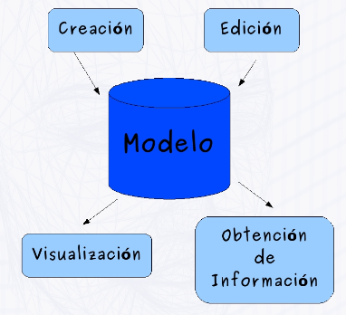
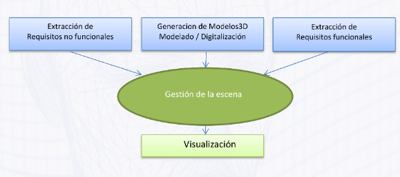

# 2. Desarrollo de Sistemas Gráficos
--- 

## 2.1 El concepto de modelo
Un **modelo** es una representación de características relevantes de una entidad que puede ser real o imaginaria. Así se permite trabajar con el modelo en vez de hacerlo con la entidad. Se acepta como inputs una creación y edición de este, y como outputs la visualización y obtención de información.

### 2.1.a Ejemplos
<a href="#s4">**Grafos de escena**</a>: Grafo que representa los elementos de una escena y las relaciones entre ellos.
**Malla de polígonos** representado por la lista de vértices, caras y semiaristas alados.
**Volúmenes**: Cubos, Pirámides, Cuerpos de revolución...
**Escenarios**: Se pueden representar como una estructura de datos a través del cual generar la escena y, a través del *renderer*, la imagen.

## 2.2 Estructura de un Sistema Gráfico

La estructura se representa con el siguiente diagrama. Detallemos de qué va cada cosa:

**Creación**: La creación del modelo se puede hacer de ***forma procedural***, a través de la ***carga de un archivo*** (modelando un objeto en otra aplicación o digitalizando un objeto de la vida real), o a través de modificaciones de una entidad que un usuario hace ***interaccionando*** con esa entidad .
**Visualización**: Genera la representación de los objetos 3D a partir de los datos que se han dado.
**Edición**: Se trabaja con varios agentes:
> Si se trabaja con el objeto y el tiempo, se denomina **animación**
Si se trabaja entre objetos, se denomina **colisión**
Si se trabaja con el objeto y el usuario, se denomina ***pick*** o **selección**

**Obtención de información** a través de la generación de listados.

## 2.3 Desarrollo de un SG
El desarrollo se representa con el siguiente diagrama. Detallemos de qué va cada cosa:

**Extracción de requisitos no funcionales**: Se trata de requisitos que no se refieren directamente a las funciones específicas suministradas por el sistema (características de usuario), sino a las propiedades del sistema. En palabras más sencillas, no hablan de “lo que” hace el sistema, sino de “cómo” lo hace.
**Extracción de requisitos funcionales**: Los requisitos funcionales son declaraciones de los servicios que prestará el sistema.
**Generación de modelos 3D**: Véase el concepto de Creación del <a href="s2">apartado 2.2</a>
**Gestión de la escena**: A partir de los inputs anteriores, se hacen todos los cambios en el grafo de escena para adecuarlo a esos inputs
**Visualización**: Véase el concepto de Visualización del <a href="s2">apartado 2.2</a>

## 2.4 Grafos de escena. Concepto y estructura.
Su objetivo es desacoplar lo máximo posible la construcción y la visualización de los elementos de la escena. El grafo de escena es un grafo dirigido acíclico (o **árbol**) que representa los elementos de una escena, y las relaciones entre ellos. A partir de esos datos, la visualización se puede realizar a través de APIs como **OpenGL** o **DirectX**.

>El grafo se construye **sólo una vez** y se modifica cuando sea necesario.

El motor de renderizado recorre el grafo y lo visualiza cada cierto tiempo, generando un ***frame*** o imagen cada vez.

Los nodos del grafo pueden ser:
- **De geometría**: Esto se refiere a objetos, fondos de escena...
- **Que influyen en otros elementos** como las luces y los materiales.
- **De gestión**: Se refiere a las vistas, los grupos de geometrías, las transformaciones (escalados,rotaciones y traslaciones)...

>#### Estructura
>Es un árbol con:
>+ Un **único nodo raíz**
>+ Nodos grupo que realizan transformaciones geométricas
>+ Nodos hoja que corresponden a figuras, luces, vistas...
>+ Nodos componente como geometrías o materiales.

>#### Características
>+ Se separa la representación de la visualización (de esta se encargaría el motor de renderizado)
>+ Está orientado a objetos, siendo que cada rama defina un componente independiente, adaptable y reusable.
>+ Se puede modificar fácilmente, ya sea en vivo (en tiempo de ejecución), o en el marco de desarrollo, ampliación y mantenimiento.
>+ Modela estructuras jerárquicas fácilmente.

### 2.4.a APIs de grafos de escena
**X3D**: Desarrollado por el Web3D Consortium, fue oficialmente incorporado al estándar multimedia MPEG-4. Añade a VRML características XML para facilitar su integración con las tecnologías Web.

**OpenSceneGraph**: Es una biblioteca gráfica multiplataforma de software libreCompletamente escrita en C++ y OpenGL. Hace un uso intensivo de STL y patrones de diseño.

**Java 3D**:API que permite la inclusión de gráficos 3D en Aplicaciones Java de escritorio y Applets. Sus objetivos de diseño son proporcionar un paradigma PDO para el desarrollo de aplicaciones gráficas y soporte para formatos estándar de archivo 3D (VRML, OBJ, etc.)

## 2.5 Problemática específica de los sistemas gráficos en web
>Desarrollar sistemas gráficos para la web es una tarea compleja. Supone ejecutar algoritmos complejos en plataformas con recursos hardware muy dispares. No nos referimos con ello a la renderización remota de gráficos o a la descarga de modelos de un servidor, sino a la visualización 3D en el marco de un navegador web

#### Problemas específicos a la hora de implementar SG en Web

1. **Volumen de información y velocidad de transferencia**: Al ser una arquitectura cliente / servidor, la distancia entre estos nodos puede ser de cientos o miles de kilómetro y con una velocidad muy variable o muy limitada. Daría un cuello de botella ya que un modelo 3D puede tener miles o millones de polígonos.
2. **Altos requerimientos computacionales** La visualización 3D requiere bastantes recursos hardware, que no todo usuario de un navegador dispone de ellos.
3. **Entorno de ejecución restringido al navegador web**: Los navegadores tienen memoria limitada, no tienen acceso directo al sistema de ficheros,ni a las bibliotecas existentes en el sistema.
4. **Diversidad de plataformas**: Hoy en día hay una variedad grande de Sistemas operativos, y aún más de navegadores. *Si no hubiera un estándar y cada uno lo hiciera a su manera, mantener un SG en web sería inviable.*

#### Tecnologías Web existentes en los últimos años

**VRML** Estándar no aceptado nativamente por todos los navegadores.Además, requiere de plugins, normalmente de pago, para su funcionamiento.
**Applets Java** Se ejecuta sobre la máquina virtual Java,por lo que se evitan las restricciones que impone el navegador.Pero está limitado a 64 MB y no soporta más de 250.000 polígonos.

>Últimamente se han desarrollado diversos estándares Web, motivados por la pérdida del monopolio de Internet Explorer y Safari. Además fue facilitado por la aparición de HTML5, que incluye nativamente un elemento canvas.Uno deesos estándares es WebGL, una biblioteca JavaScript que accede a las capacidades OpenGL del cliente.

### 2.5.a WebGL. Soluciones basadas en estándares
**WebGL (Web Graphics Library)** es una especificación estándar que define una API que se accede a través de interfaces en JavaScript para la renderización de gráficos en 3D dentro de cualquier navegador web. Está basado en ***OpenGL ES 2.0***.
 Los elementos de WebGL se pueden combinar con otros elementos HTML y estar compuestos con otras partes de la página o del fondo (background) de la página. Es multiplataforma y gratuito. Al ser derivado de OpenGL, utiliza ***GLSL***, haciendo que el uso de shaders sea obligatorio.

#### Las desventajas
+ Requiere programar a bajo nivel
+ No se dispone de primitivas geométricas. Se requiere usar Buffer Objects
+ No se dispone de matrices de transformación.Habría que implementarlas
+ No se disponen de materiales ni de fuentes de iluminación.Habría que diseñarlos e implementarlos
+ Hay que programar obligatoriamente Shaders para visualizar

#### Las ventajas
+ Proporciona flexibilidad al desarrollar sistemas gráficos; y eficiencia gracias al uso de buffer objects y shaders.

Sin embargo , las desventajas comentadas tienen mucho peso. Pero podemos dar como alternativa usar una capa sobre WebGL. Puedes escribir tu propia biblioteca de alto nivel,definiendo clases para representar geometría, materiales, etc... O no reinventar la rueda y usar una biblioteca de las ya existentes. La biblioteca líder en este campo es `Three.js`

### 2.5.b `Three.js`: Una capa de abstracción

Creada y liberada en 2010 por el español Ricardo Cabello (Mr.doob en Github), es Open Source y está bien mantenida.En la actualidad cuenta con unos 90 codificadores.

Three oculta los detalles de bajo nivel de WebGL:
+ Se representa una escena 3D usando mallas, materiales y luces 
+ Incluye las clases matemáticas necesarias (matrices y vectores)
+ Es potente: No es solo un wrapper de WebGL, sino que ademas contiene múltiples objetos predefinidos útiles en el desarrollo de juegos, animaciones, presentaciones, etc.
+ Es rápida: Usando buenas prácticas de programación, con un alto rendimiento
+ Es robusta: Dispone de chequeo de errores, excepciones y warnings en consola que facilita el desarrollo.
+ Soporta interacción (picking)
+ Soporta formatos de archivo 3D, bien a través de formatos ASCII de los programas de modelado 3D (como los archivos .obj o .mtl); o bien un formato específico de Three.js, JSON.
+ Está Orientada a objetos y es extensible
+ Es fácil de usar y de aprender. Se dispone de numerosos ejemplos para usar en nuestros proyectos

#### ¿Qué ***NO*** es `Three.js`?
+ **Un motor de juegos**: No incluye billboards, avatares, físicas, etc y no incluye soporte para redes, que es necesario para hacer juegos multijugador.

+ **Un framework de aplicaciones**: No dispone de estructuras para plantillas, gestión de sesiones, etc.

+ **Un entono integrado**: No dispone de herramientas para el desarrollo completo de aplicaciones.
