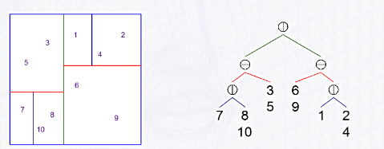

# 4b. Interacción y Detección de Colisiones.
---
## 1. Introducción

Una parte fundamental de cualquier aplicación es la interacción con el usuario. Además de la interacción típica de un usuario con la aplicación, en una escena gráfica aparecen unas particularidades como pueden ser:

> - La selección de un objeto de la escena, llamada *Picking*
> - La selección de una posición en la escena a través de sus coordenadas *XYZ*
>-  La modificación de un objeto particular que afecta a lo que se está visualizando

Tengamos en cuenta que una vez que se ha visualizado un *frame*, lo que usuario tiene es una imagen que ha salido de procesar los nodos de un grafo de escena. Cuando un usuario clica, habrá que saber, a partir de una posición 2D en la imagen, a qué figura del modelo corresponde. Además, la figura que se ha seleccionado es muy probable que pertenezca a un objeto más complejo o mayor.

Por otro lado, los objetos también pueden interactuar unos con otros.

> Hablar de interacción en la escena supone hacerlo en dos ámbitos, *usuario-escena* y *objeto-objeto* en la misma escena

En una escena puede haber un número considerable de elementos. Las operaciones de *picking* y de *detección de colisiones* implican, en última instancia, hacer búsquedas de objetos en la escena. Para que sea eficiente, habría que realizar algún tipo de indexación entr los objetos de la escena.

## 2. Entrada/Salida de Información por parte del Usuario
### 2.1 Interacción con el ratón en la escena

>El ratón tiene varias características que hacen que su procesamiento requiera un pocode atención.
>- Se usa **para todo**.
>- Tiene **pocos botones**.
>- Es 2D, y **se quiere interactuar con una escena 3D**.
>- Es un **dispositivo orientado a eventos**.

Empezando por el final, cuando se mueve el ratón se genera un evento, si se pulsa un botón, se genera un evento... Y eso ocurre *sólo* cuando el usuario decide hacer un clic.

Es habitual, en una interacción tradicional mediante teclado, que la aplicación se detenga y le pida al usuario que escriba un dato. Pero con una interacción orientada a eventos, la aplicación está funcionando y en paralelo hay unos `listeners` que están esperando a que se produzca su evento, y cuando eso ocurre, sitiene asociado una función, se ejecuta dicha función.

Por un lado, hay que decidir que eventos deseamos atender y asociarles métodos a dichos eventos. Pero también decíamos que el ratón se usa para todo y tiene pocos botones. Se tiene que definir un conjunto de estados que van a indicar qué se está haciendo en la aplicación en cada momento.

>Así,un método asociado a un evento del ratón, de manera general, implementará el siguiente algoritmo:
>1.  Consultar en que estado se encuentra actualmente la aplicación.
>2.  Consultar la información que está asociada a ese evento. Se ve qué tecla pulsa y si se pulsa `Ctrl`, `Alt` o `Shift`
>3.  Con  todo  eso,  determinar  cuál  es  el  procesamiento  que  se  está  solicitado  y  realizar las llamadas apropiadas a los métodos que correspondan.

#### Eventos del ratón que pueden escucharse

Los eventos del ratón que pueden escucharse son pulsar un botón (`mousedown`), soltarlo (`mouseup`), moverlo (`mousemove`), y hacer girar la rueda (`wheel`).

Para cada evento que quiera capturarse y procesarse hay que añadir un listener en el main:

```javascript
window.addEventListener("<evento>",(evento) => objeto.metodo(evento)) ;
```
Donde `<evento>` indica el evento que se quiera escuchar y la segunda mitad, el método que se quiera ejecutar al cumplir ese evento. 
Dentro de ese método, el parámetro le puede dar una serie de atributos:

`clientX/Y`: Coordenadas X/Y del ratón.

`which`: Botón del ratón que se pulsa. Puede ser del 0 al 3 (Ninguno, izquierdo, central o derecho, respectivamente)

`<ctrl/alt/shift>Key`: Es un booleano que indica si se ha pulsado *Ctrl*, *Alt* o *Shift* junto con una tecla del ratón.

#### Estados de la aplicación

Para conocer qué se está haciendo en cada momento para que los métodos asociados a los eventos del ratón , basta con tener definidas unas constantes que representen los distintos estados en los que se puede encontrar una aplicación y almacenar en un atributo de la clase principal el estado concreto que corresponda en cada momento.

Cuando desde la aplicación se indica que se va a hacer algo concreto, se cambia el estado de la aplicación y así, cuando desde un método asociado a un evento del ratón se consulte dicho estado se sabrá qué se está haciendo y por tanto cómo debe interpretarse dicho evento y suinformación asociada.

En definitiva,el manejo de los estados de la aplicación se convierte en un aspecto muy a tener en cuenta en el diseño de la aplicación.

### 2.2 Órdenes mediante teclado

Dar órdenes por teclado no difiere mucho de lo comntado en relación a los evento del ratón pues el teclado también se basa en eventos. Se añaden los `listeners` que quieran capturarse y se enlazan con los métodos que deban ejecutarse al aparecer tal evento.

#### Eventos de teclado
Estos son:

`keydown<up/down>`: Se produce al presionar/soltar una tecla cualquiera.
`keypress`: Se produce al pulsar y soltar una tecla cualquiera. Solo manda un evento. No puede aplicarse con *Ctrl*, *Alt* y *Shift*.

El objeto `event` donde se lee una tecla donde se produce un evento se hace con un par de líneas de código:
```javascript
//which indica el botón del ratón, keyCode indica la tecla del teclado
var tecla = event.which || event.keyCode;
//Como se devuelve un entero, podemos pasarlo como una letra así
var letra = String.fromCharCode(tecla);
//Podemos así invocar un método en ese listener
if(letra == "A"){
    //Cuerpo del método
}
```

#### Mensajes en pantalla
Se pueden hacer de dos maneras:
- Dentro de la misma página. Puede ponerse un mensaje en HTML y con JavaScript hacer que aparezca o desaparezca.
```html
<div style="..." id="mensaje"> </div>
<script>
    setMessage(string){
        document.getElementById("mensaje").innerHTML = /*Mensaje*/ ;
    }
</script>
```
- Con un pop-up, con el método `alert`:
```javascript
window.alert("Mensaje de la alerta");
```

## 3. Selección de Objetos. *Picking*

Hay una interacción del usuario con la apicación fundamental hoy en día, que es señalar directamente al objeto. Da lo mismo que se use un ratón o un panel táctil. Todos producen una posición 2D en la ventana de la aplicación, pero pueden apuntar a objetos 2D o 3D. 

Para ello, hay que realizar un cambio de sistema de referencia, donde la entrada es una posición 2D y el objeto seleccionado puede estar en un sistema de coordenadas de mundo de una escena gráfica en 2D o 3D. Para saber los puntos de la escena que corresponden a un punto en la pantalla haremos uso del *Raycasting*.

El *Raycasting* trata de determinar lo que está seleccionando un usuario cuando hace clic en la pantalla. Podemos seguir el siguiente algoritmo

>1. Se lanza un rayo que parta del centro de proyección de la cámara y que pase por el píxel seleccionado.
>2. Ese rayo entra en la escena y pone como candidatos aquellos objetos atravesados por el rayo.
>3. Los candidatos estarán a distinta distancia. El candidato que se seleccionará será el más cercano a la cámara, que bien puede ser el único que se vea por que sea el único o porque no se vean los objetos de atrás.

#### Accediendo a la figura global

Lo más normal es que queramos acceder a la figura global, y no a un Mesh de estos.
Si tenemos un objeto complejo, por ejemplo, un personaje, y queremos que al pulsar camine, tendremos en cuenta que al clicar no se llega al personaje de por sí, si no a una mano o la cabeza. Si queremos que se arrastre, usaremos el atributo `userData`, el cual se referenciará a la raíz del subárbol que representa el modelo.

Así, cuando se procesa el *picking* y obtengamos un `Mesh` de ese personaje, podremos llamar a los métodos de la raíz del modelo.

#### Feedback

La interacción con el usuario **debe ser bidireccional**. Cada vez que el usuario seleccione un elemento con la escena, la aplicación debe infomarle de alguna forma que la selección se ha producido.

La forma más habitual es cambiando el aspecto de ese elemento para que se distinga y el usuario confirme su entrada.

## 4. Detección de colisiones
Otro modo de interacción es dentro de la misma escena, cuando unos objetos colisionan con otros, operación que puede ser costosa ya que habría que comprobar si la geometría de un objeto interseca con la geometría de los demás.

Para acelerar ese proceso se hace en dos fases:

**Fase gruesa**: Implementa un algoritmo rápido que descarta elementos que no colisionan.

**Fase fina**: Para aquellos que tengan probabilidad de colisión, se determina la colisión usando un algoritmo preciso pero más lento.

La precisión viene determinada por los requerimientos de la aplicación. La detección fase gruesa se basa en 2 cosas:
>1. Tener la escena indexada  espacialmente. La búsqueda de objetos a colisionar se acelera si sabemos dónde están los objetos y descartar los que no estén en la zona.
>2. Envolver el objeto en una caja o esfera . El motivo es que es más rápido determinar si dos esferas o  dos cajas se están intersecando.

### 4.1 Indexación espacial de la escena

En cuanto a la indexación espacial de la escena, se basa en descomponer recursivamente el espacio dividiéndolo así en sectores para determinar rápidamente qué elementos no están en el mismo sector.

Para la subdivisión se pueden emplear dos estrategias:
> - *Kd-Tree*: La subdivisión equilibra el número de elementos
> - *Octree*: La subdivisión equilibra el volumen de cada parte

#### *Kd-Trees*
A partir de un sector con todos los objetos, se va subdividiendo ese sector en 2 de amnera que que el número de elementos en cada subsector sea igual o de diferencia mínima. Si se supera un mínimo establecido previamente, se vuelve a dividir recursivamente.
El plano o linea de subdivisión cumple estas condiciones:
- Siempre se alinea con los ejes.
- El eje se alterna en cada nivel.
  
  


#### *Octrees*
Con este criterio, cada vez que en un sector se supera el número máximo de elementos permitidos, se subdivide en 4 cuadrantes u 8 octantes con un área o volumen exactamente iguales, de manera recursiva.

#### ¿Y cómo indexo en `Three.js`?
En `Three.js` se indexa mediante *octrees* con la biblioteca `Octree.js`, y se usan mallas generadas por CPU. Se usa así:
>1. Construye el árbol, vacío.
>2. Añadimos los elementos a indexar
>3. Realizamos las búsquedas cuando proceda
>- Cuando se haga *picking*, mediante *RayCasting*
>- Cuando se detecten colisiones, por la cercanía.

Vayamos por partes:

**1.*Construye un árbol***
Para ello instanciamos la clase Octree, como vemos en este fragmento de código:

```javascript
this.octree = new THREE.Octree({
    /*Undeferred: Si es true, los objetos añadidos al árbol se insertan automáticamente.
     Si es false, se insetar al actualizar. Ponerlo a false aumenta el rendimiento.*/
    undeferred:false,
    /*Depthmax: Indica la profundidad máxima del Octree. 
    Se puede dejar en infinito si se pne un nº máximo de objetos por sector*/
    depthMax:Infinity,
    /*ObjectsThreshold: Umbral de objetos para subdividir un nodo*/
    objectsThreshold: 4,
    /*overlapPct(% de solapamiento): Facilita la gestión de objetos en la frontera de un nodo. 
    Al haber solapamiento, se facilita las búsquedas de las figuras que se encuentren justo en la frontera
    entre 2 nodos.*/
    overlapPct:0.2  
})
```

**2.*Añadimos los objetos a indexar*** Una vez que el árbol esté construido, hay que añadir los `Mesh` que se deseen indexar. Se puede considerar también las caras de la geometría para mejorar las búsquedas.
Recordad que hay que actualizar el *Octree* mediante un `update`.
```javascript
/*Añadimos un elemento considerando las caras de la geometría*/
this.octree.add(this.unMesh,{useFaces:true });
/*Y actualizamos*/
update (){ 
    /*...*/
    this.renderer.render(this,this.getCamera ());
    this.octree.update();
    /*...*/
}

```

**3.*Realizamos búsquedas en el Octree***

> Cuando hacemos un *Picking*, se obtiene el nº de candidatos según el *Octree*, y de ahí, cuáles se intersecan con el rayo del *Raycaster*
```javascript
/* Se parte de un objeto THREE. Raycaster construido según la cámara actual y la posición del ratón
 ( consultar la sección Picking )*/
// Se obtiene el conjunto de candidatos para el picking 
var octreeObjects = this.octree.search ( 
    raycaster.ray.origin ,
    raycaster.ray.far ,
     true ,
     raycaster.ray.direction
    );
// Se busca cuales de esos candidatos son atravesados por el rayo 
var intersections = raycaster.intersectOctreeObjects ( octreeObjects );
// Si hay alguno , el más cercano está en intersections [0]
```
> Cuando queremos buscar objetos con los que se pueden colisionar, usaremos el *Octree* para buscar candidatos
```javascript
/* Suponer que el objeto que se está moviendo es objetoMovil y tiene un radio aproximado 
de 1 unidad.*/
// Se obtiene el conjunto de candidatos para la búsqueda de colisiones 
octreeObjects = octree . search ( objetoMovil . position , 1, true );
/* Se busca la posible colisión del objeto móvil solamente con los objetos de la lista*/
```