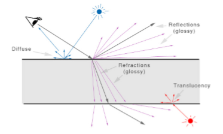

<style>
 blockquote{
     border-left-color: #00bbff;
 }
 .vscode-light h1, .vscode-light hr, .vscode-light table > tbody > tr + tr > td{
     border-color: #00bbff;
 }
</style>

# 5a. Materiales
## 1. Introducción

>Tras modelar una escena en cuanto a la geometría de los elementos que intervienen en ella, es necesario generar una imagen y mostrarla.  Un sistema gráfico, por tanto, no se queda en la creación o adquisición de información gráfica y su representación, sino que un módulo importante del sistema es la generación de la imagen que muestra al usuario la información gráfica que gestiona.

### ¿Qué ocurre cuando alguien capta una imagen, digital o analógica, de una escena?
Todo comienza en la luz y cómo reacciona ésta con los objetos según el material con el que estén hechos. Cuando un rayo de luz incide en un punto de un objeto, parte de esa luz incidente se refleja en todas las direcciones, es lo que se denomina reflexión difusa.

Se tiene,por tanto,que un aparte del proceso de captación de una imagen de una escena es un trabajo de geometría. Una proyección de un escenario 3D a una imagen 2D, y en ese proceso hay que contemplar la proyección en sí misma de cada objeto, la distorsión con la que se perciben los objetos debido a la perspectiva (las zonas más lejanas se proyectan más pequeñas en la imagen que las más cercanas) y el hecho de que unos objetos ocultan a otros.

Cualquier algoritmo que genere una imagen 2D a partir de una escena 3D debe ocuparse de la proyección, la perspectiva y la ocultación. Pero otra parte del proceso es qué ha ocurrido con la luz y los materiales antes de que esos rayos salieran de ese punto del edificio hacia la lente de la cámara.

Decíamos que cuando un rayo de luz incide en un punto de un objeto, parte de ese rayo se refleja en todas las direcciones, por tanto cada punto de la escena se convierte en una fuente de luz indirecta. 

¿Por qué razón no se ven absolutamente negras las zonas en sombra, si no le da la luz directa del Sol? Porque también estan iluminadas,aunque sea con una menor intensidad,porel resto del escenario que actúa como fuente de luz indirecta.

Pero según sea el material de un objeto, se producen otros fenómenos con la luz. Si el material está pulido, una gran parte de la luz que incide en un punto será reflejada en la dirección simétrica,reflexión especular.

Por otro lado, en los objetos que son de un material parcialmente transparente (se hablaría de opacidad o transparencia, un concepto es el opuesto al otro), parte de la luz que incide en un punto será transmitida a través del objeto posiblemente desviando su trayectoria (refracción), o generando rayos transmitidos a través del objeto en todas las direcciones (translucencia).

 Cada uno de esos innumerables rayos van recogiendo información de los objetos y materiales por donde van pasando, de manera que el color de un píxel no es más que un reflejo de toda la información recogida por todos los rayos que llegan a ese píxel.

 ### 1.1 Modelo de iluminación
 Reproducir todo ese proceso de geometría y fotometría en un ordenador es imposible. 
 Por tanto, para reproducir en un ordenador dicho proceso de generación de una imagen a partir de una escena virtual (rendering), se tienen que elegir un subconjunto finito de entre todas las propiedades físicas de la luz y de los materiales que intervienen el el proceso. A ese conjunto de propiedades elegidas, junto con el modo de procesarlas, es a lo que se denomina modelo de iluminación.<br>En función del modelo de iluminación elegido se obtendrán imágenes más cercanas o alejadas a lo que captaría una fotografía. A mayor cercanía en cuanto a calidad a una fotografía, más tiempo de cálculo. La calidad de una imagen y el tiempo empleado en generarla depende de lo completo que sea el modelo de iluminación elegido.

 ### 1.2 Materiales
 
 Fijándonos en la figura podemos ver:

 - En azul, un rayo luminoso de la fuente de luz que impacta en el objeto y se refleja desdoblándose en varios rayos por todas las direcciones, de los cuales uno llega al observador.(Reflexión difusa)
 - En rojo, un rayo que impacta desde atrás del objeto (suponiendo que es translúcido) el cual se separa en otros rayos por todas las direcciones.
 -  En negro, cuando impacta en el cuerpo se desdobla en dos rayos visuales (también en negro), *reflexión especular y refracción*, permitiendo a ese observador ver reflejado como un espejo lo que ocurre a un lado de ese cristal, al mismo tiempo que ve refractado lo que se encuentra al otro lado del cristal.
 -  En morado, es un caso específico del rayo negro. Si la superficie no está perfectamente pulida lo normal es que el impacto de ese rayo visual pruduzca más de un rayo reflejado, reflexiones glossy, abiertos en abanico, haciendo que se vea borroso.

 ### 1.3 Componentes especular y difusa
 En general,en un material se consideran dos componentes: La **componente especular**, referente a los rayos reflejados en la dirección simétrica a la dirección desde donde impactó el rayo de entrada. Salen en un abanico más o menos cerrado y tienen una *intensidad media-alta*.<br>
 La **componente difusa**, se refiere a los rayos que son reflejados en todas las direcciones. Tienen una *intensidad baja*.

 Todos los materiales tienen componente difusa y aquellos materiales que representan acabados pulidos, además tienen componente especular.
Un modelo básico de iluminación que considere ambas componentes, ¿cómo calcularía el color en un punto?

Lo primero es indicar que <mark>no sería correcto hablar de cálculo de color, si no de cálculo de energía luminosa</mark>, aunque finalmente esa energía luminosa se transforme en un color en el píxel.
Una *ecuación básica* de ese cálculo, que considera la energía añadida por componente difusa y la componente especular, sería : 
$$E_{out}=E_{in}·k_d·cos(α)+E_{in}·k_e·cos^n(β)$$
- $E_{in}$ es la energía del rayo luminoso de entrada
- $E_{out}$ es la energía luminosa calculada en dicho punto y que llega al observador
- $k_d,k_e,n$ son constantes que dependen del material
- $α$ es el ángulo que forma el rayo luminoso de entrada con el vector normal del objeto en dicho punto
- $β$ es el ángulo que forma el rayo visual del observador con el rayo luminoso reflejado en la dirección simétrica a la dirección de entrada.

Un modelo de iluminación tradicional, como es el *modelo de **Phong***, considera una componente más, la **componente ambiental**. Este modelo no tiene en cuenta la iluminación indirecta que hay en la escena, o mejor dicho, no calcula la iluminación indirecta que recibe cada punto en la escena procedente del resto del escenario. La aproxima considerando que hay una cantidad de luz en el ambiente, constante en toda la escena, que es la que procedería de la iluminación indirecta. A esa cantidad de luz, constante en toda la escena, se le denomina **luz ambiental**.

Un modelo básico de material muy usado tradicionalmente en computación es el basado en el modelo de *iluminación de Phong*, donde un material quedaría definido por 3 colores y un escalar.

La **componente difusa** se define mediante un color, es el color del objeto, también denominado **color difuso**.

Si el material está pulido pueden verse brillos en los objetos. Lo normal es que el color en esas zonas más brillantes también tengan como base el color del objeto, pero aclarado, muy cercano al blanco, el color especular.
Y en cuanto al escalar que forma parte de la definición del material, denominado **exponente de reflexión especular**, se trata de un valor para indicar como de intensos y extensos son esos brillos.Un valor más alto indica brillos pequeños en cuanto a la superficie que ocupan pero de una intensidad alta, y un valor bajo produce brillos que en los objetos ocupan más superficie, pero de una intensidad menor. 

Otros materiales más complejos se definirán en base a definir más componentes, también nombrados en la literatura como canales. Se diría en ese caso *canal difuso*,*canal especular*, etc.

 ## 2. Materiales `Three` basados en colores
 Dado que Three es una capa sobre WebGL,todo el proceso que implica la visualización se realiza en la GPU, la cual ejecuta programas *shaders*.  El uso de *shaders*, por tanto, **es obligatorio**.

 Un programa *shader* recibe toda la información necesaria involucrada en un modelo de iluminación, información sobre las luces, la geometría de los objetos, los materiales e implementa los algoritmos del dicho modelo de iluminación.

`Three` incorpora, de una manera transparente al programador, los programas *shaders* correspondientes a los modelos de iluminación que implementa. El desarrollador solo tiene que asignar materiales a los Mesh de su escena. Cada material tiene asociado su propio shader.

### 2.1 La clase `Material`
Se trata de una clase abstracta, es la clase base para todos los materiales y define un conjunto de atributos que son comunes a todos ellos.

- `name`: Permite identificar el material con un nombre
- `transparent`: Boolean. Si false, la figura será 100% opaca Si true, la figura será transparente según el atributo de opacidad.
- `opacity`: Indica el nivel de transparencia con un valor entre 0.0 (invisible) y 1.0 (opaco)
- `visible`: Booleano . Si se pone a `false` se le está indicando al visualizador que no procese los Mesh que tengan este material. Por lo tanto tiene el efecto de hacer esas figuras invisibles.
- `side`: Indica en qué lados de una cara se aplica el material, sus valores posibles son las constantes `THREE.FrontSide`, `THREE.BackSide`, `THREE.DoubleSide`, con el significado que indica cada constante.
- `wireframe`: Booleano . Se pone a true para ver una figura en modo alambre.Sea cual sea el material que tenga.
- `shading`: Permite configurar el modo en el que se colorean los polígonos. Con el valor `THREE.FlatShading` se hace un cálculo de color por polígono y todo el poligono se colorea de dicho color, notándose el facetado del objeto. Con el valor `THREE.SmoothShading` se realiza u cálculo de color por píxel con lo cual el objeto presenta un degradado suave en sus colores, no apreciándose el facetado de la malla de polígonos que la define.

Hay que indicar que no es lo mismo poner el atributo `visible = false`; que poner los atributos `transparent = true; opacity = 0.0;`. Uno directamente no renderiza, y el otro lo dibuja pero no se ve.

En cuanto al modo alambre, además de que simplemente sea el material que se desea para una determinada figura,se puede usar para diferenciar temporalmente una figura del resto, por ejemplo para dar un *feedback* al usuario en un *picking*.

Existen dos modos de darle valores a los atributos de un material. Una forma es en el momento de instanciar la clase.En cuyo caso hay que pasarle al constructor un único parámetro de tipo diccionario con los atributos y valores que se quieran asignar. Y otra forma es, después de instanciar la clase, darle valores a los atributos del material que se ha instanciado.

### 2.2 La clase `MeshNormalMaterial`
Se trata de un material básico, una forma rápida de ponerle un material a una figura cuando todavia no se sabe qué material ponerle. Se crea con la clase `MeshNormalMaterial()`, no necesita parámetros ya que con los valores por defecto ya es suficiente en la mayoría de las ocasiones. Mediante este material, a cada vértice de la geometría se le asigna un color que no es más que interpretar el vector normal en dicho vértice como si fuese un color.

### 2.3 La clase `MeshLambertMaterial`
Implementa el *modelo de **Lambert***. Este modelo contempla las componentes ambiental y difusa. Al no tener la componente especular los materiales resultantes son mate,no muestran brillos. Pueden mostrar tonalidades claras del color del objeto según le incida la luz y según la orientación del observador pero sin mostrar los brillos que son propios de la componente especular. 

No obstante, este material permite añadir opcionalmente **una componente emisiva** que simula la *emisión de luz*.

Los materiales con componente emisiva se usan para ponérselo a farolas,bombillas, etc. Para transmitirle al observador la percepción de que dicha luminaria está encendida.

No confundirse, un objeto con un material con componente emisiva no emite luz, no ilumina nada, solo da la sensación de que sí lo hace.

Dicho esto, ¿qué atributos añade este material a la clase base?
- `color`: Define el **color difuso** de la figura
- `emissive`: Define el **color emisivo de la figura**. Por defecto es negro pero cuando se quiere usar se suele poner blanco, o al menos un color muy claro.
- `emissiveIntensity`: Define la **intensidad de la componente emisiva**. Un valor real entre 0 y 1.

### 2.4 La clase `MeshPhongMaterial`

Esta clase implementa el *modelo de **Phong***, que contempla las componentes ambiental, difusa, especular. Aunque esta clase también contempla la componente opcional emisiva. 

A efectos prácticos, es como la clase `MeshLambertMaterial` más la **componente especular**. Esta clase se usa para representar materialesque sí produzcan brillos.

Los atributos que añade esta clase con respecto a la clase `MeshLambertMaterial` están relacionados con esta componente, y son:
- `specular`: Define el color de los brillos de la figura. Como se ha comentado previamente, el color especular suele definirse tomando como base el color difuso de la figura y aclarándolo hasta casi el blanco.
- `shininess`: Define la intensidad de los brillos, por defecto tiene un valor de 30. Recordar la explicación que se ha dado del exponente de reflexión especular previamente.

El color difuso,no tiene por qué ser un único valor fijo almacenado en el material y que se aplique en toda la figura, sino que puede tomarse de una imagen y por tanto poder definir el color difuso de un material con todos los colores disponibles en una imagen concreta y así tener en una figura múltiples colores.

A las imágenes que se usan para este fin se le denominan texturas, para diferenciarlas de la imagen que se genera al visualizar la escena, a la que se le denomina imagen, render o frame. Igualmente, a los píxeles de una textura se le denominan téxeles.
Pero,¿cómo se realiza esa correspondencia entre los puntos 3D de un sólido y los téxeles 2D de una textura?

Para ello, cada vértice de la malla de polígonos que define la piel de la figura, además de tener su coordenada $(x,y,z)$ que establece su posición en el espacio, tiene una coordenada de textura $(u,v)$, bidimensional, que establece su mapeo en la textura. Las coordenadas $u$ y $v$ son valores normalizados en el intervalo $[0,1]$ de manera que la esquina inferior izquierda de la textura es la coordenada $(0,0)$ y la esquina superior derecha de la textura es la coordenada $(1,1)$.

En `Three`, las geometrías que se construyen con clases de su biblioteca son construidas con las coordenadas de textura ya calculadas para cada vértice. En las nuevas figuras, no solo hay que calcular las coordenadas de los vértices y sus conexiones para formar polígonos, también hay que calcular las coordenadas de textura si se quiere poder aplicar materiales con textura a estas primitivas.

Aunque el uso de las texturas más habitual sea para dar color a las figuras, como si se envolvieran en un papel de regalo, no es ni mucho menos el único. Porque al igual que el color que hay en un téxel de la textura se interpreta como un color para colorear un punto en la piel de la figura, el color de ese téxel se puede interpretar de otra forma para definir o modificar otros parámetros del material y conseguir otros efectos en la visualización que se haga de las figuras que tengan ese material.

### 3.1 Cargando texturas en Three
>Usar texturas para definir un material en Three requiere diferentes acciones. Para cada una de ellas hay que:
>1. Cargar la textura.
>2. Configurar cómo se aplica: posición, orientación, repeticiones.
>3. Asignarla a un canal de un material.

#### Carga de la textura
Hace falta un cargador de texturas. Se obtiene instanciando la clase `TextureLoader`.
Se pueden usar imágenes `png`, `gif`, o `jpg`. Aunque no hay un tamaño obligatorio, los mejores resultados se obtienen con imágenes cuadradas y resolución potencia de 2.
La textura cargada se referencia con una variable que se usará para configurarla.
```javascript
var loader = new THREE.TextureLoader (); 
var textura = loader.load ( 'ruta / imagen .png');

 ```

#### Configuración de la textura
Ws posible realizar modificaciones en el espacio de la textura, como giros o desplazamientos de manera que facilita el posicionamiento y orientación de la textura en la figura.
Hay que entender estas operaciones como si se partiera de la textura original,se cargara en un editor de imágenes como Gimp o Photoshop y tras dichas operaciones se obtuviera una textura modificada que es la que se aplica;es sobre la que se mapean las coordenadas de textura de los polígonos.
Para las operaciones que se hagan en el espacio de la textura se referenciará al sistema de coordenadas 2D de la textura, denominando S al eje horizontal y T al eje vertical.

##### Repeticiones
Se puede replicar la textura varias veces y de manera independiente en los ejes S y T. Las repeticiones en cada eje se indican en el atributo de la textura `repeat` que se puede definir con el método `set`.
No obstante,esta operación tiene 3 modos de actuación,y en cada eje se puede establecer un modo distinto.
- `THREE.RepeatWrapping` La textura se repite en esa dirección (S o T) tal cual. Es el modo por defecto.
- `THREE.MirroredRepeatWraping` La textura se repite en esa dirección (S o T) reflejada
- `THREE.ClampToEdgeWrapping` La textura no se repite, pero los téxeles de la frontera de la textura sí.

Si en la textura aplicada a un canal del material se cambia el modo de repetición, hay que indicar que es necesaria una actualización en dicho canal con  `material.map.needsUpdate = true`.
##### Desplazamientos
El desplazamiento es bastante útil para recolocar la textura en horizontal y en vertical. Si tras aplicar una textura a un objeto se observa que “los dibujos” de la textura caen más bajos de lo que se deseaba, basta con aplicarle un desplazamiento hacia arriba a la textura.

El atributo de la textura que hay que definir es el atributo offset que se modifica con el método set, con los dos parámetros que indican desplazamiento en los ejes S y T.
Tener en cuenta que el desplazamiento se produce en la dirección opuesta al parámetro.

##### Giros
Con esta operación la textura generada está girada con respecto a la cargada. Un giro que se hace siempre por un eje perpendicular al plano que contiene la textura y que pasa por un centro de giro.
El atributo para aplicar un giro es el atributo rotation de la textura, dándole un ángulo en radianes.
El centro de giro,que por defecto está en la esquina inferior izquierda,también se puede cambiar modificando el atributo center con el método set.

#### Canales donde aplicar texturas
Se considera que se usan materiales `MeshLambertMaterial` o `MeshPhongMaterial`.
##### Canal difuso
Es el canal donde se indica el color base de la figura. Como se ha comentado, es el canal más usado para definir un material mediante una textura ya que permite tener en un material diferentes colores y con pocas figuras sencillas se pueden simular escenarios más complejos.

No obstante, se tienen dos canales difusos.
- `color`: Se le asigna un `color2`. Es el color base del objeto. 
- `map`: Se le asigna una textura. Los téxeles son interpretados como color base en el cálculo de iluminación.
  
##### Canales para simular relieve
La simulación de relieve donde no se ha modelado se consigue actuando sobre los vectores normales del objeto. Estos canales no están disponibles en el material `MeshLambertMaterial`.
Una forma muy intuitiva de entenderlo es pensar que los vectores normales son como unos “palitos” que salen de la superficie de un objeto y que siempre, el trozo de superficie de donde sale el vector va a estar perpendicular a dicho vector. De modo que si tomamos un vector y lo inclinamos, para que el trozo de superfice que hay en su base se mantenga perpendicular, solo es posible si la superficie cede y se “arruga”.
La percepción del objeto es como si se hubiera modelado para que realmente su superficie en cada punto se corresponda con las normales utilizadas en el modelo de iluminación.
Existen dos modos habituales para actuar sobre las normales y conseguir simular relieve. Three dispone de un canal para cada modo. Se puede usar uno u otro, pero no los dos simultáneamente.


###### Modificando las normales existentes
Se usa una textura en tonos de gris y la normal en un punto del objeto se modifica teniendo en cuenta el gradiente de tono de gris de la textura en el téxel donde se mapea el punto del objeto considerado. A estas texturas se les llamatexturasbumpmapo de perturbación de las normales.
Como sabéis, el gradiente es como la pendiente en una gráfica.
En `Three`, el canal para obtener relieve modificando las normales existentes es `bumpMap`. El material dispone de otro atributo, `bumpScale`, que es un escalar para controlar cómo de intenso (valores altos) o suave (valores bajos) será el efecto.

###### Sustituyendo las normales existentes
La segunda forma de actuar sobre las normales es sustituirlas por otras. En este caso, son las normales lo que está almacenado en la textura. Cuando se está aplicando el modelo de iluminación en un punto del objeto se toma para los cálculos la normal que le corresponde según la textura sin tener en cuenta para nada la normal original. A estas texturas se les llama texturasnormalmap.
En Three, el canal para obtener relieve sustituyendo las normales existentes por la de la textura es normalMap, y también tiene un ajuste de la intensidad en otro atributo, normalScale, aunque en este caso se trata de un Vector2 cuyas componentes pueden variar entre 0 y 1. Ese factor de escala sirve para provocar una inclinación mayor o menor en la dirección x e y de manera independiente. Aunque lo usual es que las dos coordenadas de ese vector 2D de escala sean iguales entre sí de manera que se realce o se atenúe el efecto de relieve sin alterarlo hacia ninguna dirección.

##### Canal especular
Este canal es muy similar a lo que en programas de edición de imágenes se denomina *canal alfa* asociado a un efecto.
Se trata de una textura en tonos de grises donde la interpretación que se hace de cada téxel es cuánto porcentaje de efecto se aplica en el punto del objeto que se mapea en dicho téxel, teniendo en cuenta que si en el téxel hay un negro puro, se aplica un 0% de efecto; y si hay un blanco puro, se aplica el 100% del efecto. Si hay un gris, se aplica el porcentaje de efecto correspondiente a la cantidad de blanco que hay en dicho gris.
En el material `MeshPhongMaterial` se trata de una textura para controlar la cantidad de **componente especular** que interviene en el cálculo de la iluminación en cada punto del objeto. Se puede controlar en qué zonas del objeto se quieren evitar brillos total o parcialmente. El canal se denomina `specularMap`.

##### Canal de transparencia
En este caso la textura, en tonos de gris, controla la opacidad de un objeto. El téxel negropuroindica 0% de opacidad (100% de transparencia)y el blanco puro indica lo opuesto.
El canal se denomina `alphaMap`. Aunque para aplicarlo hay que definir un multimaterial, ya que es necesario aplicar en la misma figura 2 materiales, uno para la parte exterior y otro para la parte interior.
Aunque podría pensarse, con lógica, que debería bastar con poner el atributo side del material a `THREE.DoubleSide`, así no se obtiene el efecto deseado.

##### Sincronización de texturas
Como puede verse, es habitual en la definición de un material que se usen diversas texturas en diferentes canales: color difuso, relieve, etc.
Algunas veces, las texturas deben estar sincronizadas perfectamente para que el resultado final no presente efectos extraños.

Como puede verse, es habitual en la definición de un material que se usen diversas texturas en diferentes canales: color difuso, relieve, etc.
Algunas veces, las texturas deben estar sincronizadas perfectamente para que el resultado final no presente efectos extraños.

Esta sincronización debe tenerse en cuenta cuando se quieran modificar las texturas en cuando al número de repeticiones, desplazamientos y giros. Las transformaciones que se hagan, deben hacerse con los mismos parámetros en todo el grupo de texturas que deban estar sincronizadas.

En `Three` *no hay un mecanismo para hacer la sincronización automáticamente*. No hay una forma de indicar que determinadas texturas forman parte de un grupo sincronizado. <mark>El programador es el responsable de aplicarle a todas las mismas transformaciones</mark>.


### 3.2 Texturas de entorno
Se ha hablado de los diferentes elementos que intervienen en un escenario, objetos con sus materiales, luces, posiblemente un suelo, pero ¿y el fondo?
>Las **texturas de entorno** dan la solución. Se trata de una textura que envuelve a la escena de manera que al igual que en el mundo real, teniendo una continuidad al ver el entorno.

Para definir un entorno de este tipo hay que usar texturas `cubemap`. Son un conjunto de 6 texturas cuadradas con las que se puede texturizar el interior de un cubo de manera que, poniendo la escena en el interior del cubo se consigue ese efecto de fondo continuo que se persigue.

Suele haber un lugar específico en el grafo de escena para asignar ahí la textura cubemap previamente cargada y así obtener el efecto de fondo continuo requerido,sin tener que preocuparse por el tamaño de la escena ni el tamaño de ningún cubo que soporte la textura `cubemap`. En el caso de `Three`, la textura hay que asignarla en el atributo `background` del nodo raiz de la escena.

#### Sobre la reflexión del entorno
Cuando se tiene un entorno, y en la escena hay objetos con una alta reflexión especular, como espejos, materiales cromados, etc. se espera que dichos objetos reflejen ese entorno.
Ello es posible asignando en un canal específico del material de dichos objetos la misma textura `cubemap` que se haya usado para el entorno de la escena. El canal se denomina `envMap`. 
#### Sobre la refracción del entorno
De igual modo, los objetos parcialmente transparentes dejan ver el entorno a través de ellos. Como ocurría en el caso de la reflexión del entorno del apartado anterior, hay que usar la misma textura `cubemap` en el canal `envMap` del material.
Pero en esta ocasión hay que modificar el modo de mapear la textura de dicho canal y, cómo suele ocurrir cuando la luz atraviesa un objeto parcialmente transparente que además es de un material de diferente densidad a la densidad del aire, la luz se refracta. Si se quiere ese efecto hay que indicar un índice de refracción. 

### 3.3 Usando un vídeo como textura
En Three también se puede usar un vídeo como textura. Así se podría modelar un cine y proyectar una película.

Un vídeo puede considerarse como una sucesión de imágenes y cada una de estas imágenes se podría usar como textura. Solo habría que ir cambiando de textura a un ritmo de 24 imágenes por segundo.
Para conseguirlo, se debe implementar una parte en el archivo `html`. Se carga el vídeo pero no se muestra, aunque se le indica que se inicie solo.<br>
En el archivo `Javascript` que corresponda se crea y configura una video-textura a partir de dicho vídeo.
```html
<video id="video" autoplay loop style ="display : none" src=" ruta /y/ fichero"> </video>
<script>
    // Se referencia al vídeo que se ha incluído en el html
    var video = document.getElementById ('video');
    // Se carga y configura una video−textura 
    var texture = new THREE.VideoTexture ( video ); 
    texture .generateMipmaps = false ; 
    // si el vídeo no es cuadrado 
    texture.minFilter = new THREE.LinearFilter ;
    // Ya solo queda asignarlo en el canal map de un material
    materialPantallaCine .map = texture ;

</script>
```


