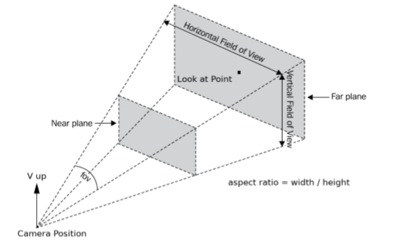
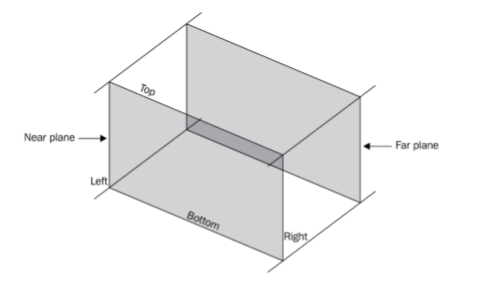
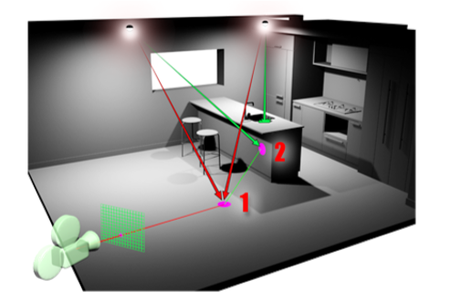
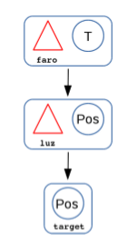

<style>
 blockquote{
     border-left-color: #00bbff;
 }
 .vscode-light h1, .vscode-light hr, .vscode-light table > tbody > tr + tr > td{
     border-color: #00bbff;
 }
</style>

# 5b. Vistas y Luces
## 1. Introducción a las vistas
>La cámara ayuda a atraer la atención de espectador a una parte concreta de lo que está occurriendo, o nos permite que tengamos una visión global de la escena, desde un punto de vista u otro.
La cámara es un personaje más de la escena, en concreto el objetivo de la cámara son los ojos del espectador. Como tal personaje, también se puede animar, cambiar su posición, su orientación, etc.
Sin embargo, todos los cambios que se hagan con la cámara deben hacerse con mesura. Son los ojos del espectador y los movimientos rápidos o los cambios de plano sin dar tiempo a asimilar lo que se veía en el plano anterior provocarán molestias en el espectador.
### Planos de encuadre
En este sentido, la selección del plano de encuadre es fundamental para centrar la atención en lo que se desea. Según se abarque más o menos escena se puede hablar de planos:
- **General**:  Muestra una porción amplia de la escena, abarcando varios personajes y el entorno en el que transcurre la acción. El espectador puede ver a los diferentes personajes que tienen el protagonismo en ese momento,el escenario en el que transcurre la acción y la distribución espacial de los distintos elementos.
- **Medio**: El entorno va perdiendo protagonismo en pro de algunos de los personajes. 
- **Primer plano**: Se trata de un plano del rostro de un personaje, para mostrar su expresión.
- **Primerísimo primer plano**:El ángulo se cierra aún más centrándose el interés en solo una parte del rostro del personaje, como los ojos o la boca. 
- **De detalle**:  La cámara se centra en algún objeto o en una parte concreta de un personaje como las manos o los pies, para que el espectador se fije en dicho elemento.
- **Americano**: También conocido como plano medio largo, abarca desde la cabeza del personaje hasta más o menos las rodillas. Es un plano muy usado en el *Western* ya que hay que mostrar cómo el personaje desenfunda su pistola.

El uso de un plano u otro está determinado por una regla básica en el mundo de la fotografía: todo lo que aparezca en la imagen debe aportar, ya sea como centro de interés o como contexto y en ningún caso distraer.

## 2. Definición de una cámara
La vista más usada en informática gráfica es la vista cónica o perspectiva ya que es el modo en el que el ojo humano capta las imágenes. Por tanto, los efectos típicos de la proyección cónica como que los objetos lejanos se ven más pequeños, o que las líneas paralelas tienden a converger en un punto de fuga, hace que dichas imágenes generadas por ordenador se perciban naturales.



### 2.1 Vista cónica
Una proyección cónica se basa en lo siguiente: de todos los puntos de la escena parten semirectas (proyectores) hacia el centro de proyección. En su recorrido atraviesan el plano de proyección (el frame) donde se conforma la imagen.

La vista se compone de varias partes:
- Centro de proyección, es decir, donde se coloca la cámara.
- Vector VNP (normal al Plano de Proyección), define hacia dónde mira la cámara.
- Vector vertical vUp. Define el giro del plano de proyección con respecto a su normal.
- Ángulo o Campo de Visión FOV. Determina la cantidad de escena que se quiere captar.En una cámara convencional es lo que se modifica al hacer zoom. Si se quiere tener una visión tal cual la captaría un ojo humano, el ángulo FOV debería tener un valor entorno a los 45º
- Ratio de aspecto. Es la relación entre el ancho y el alto del frame. 
- Near, plano de recorte cercano. Todos los objetos, o sus partes, que estén entre este plano y el centro de proyección no son procesados en la visualización
- Far, plano de recorte lejano. Todos los objetos, o sus partes, que estén más lejos de este plano no son procesados en la visualización.



### 2.2 Vista paralela
Otra vista típica en informática gráfica es la vista paralela. Usada normalmente para mostrar la escena desde un punto de vista ortogonal superior.

La característica de una vista paralela es que los proyectores no convergen en un centro de proyección, sino que transcurren paralelos entre sí. Y aunque no es obligatorio, normalmente los proyectores son perpendiculares al plano de proyección.

Debido a dicha característica, no procede hablar de centro de proyección ni de ángulo *FOV*.No obstante, en la definición de la vista sí hay que indicar el vector que marca la dirección de los proyectores, el cual se puede definir mediante dos puntos: posición de la cámara y punto de mira. El vector `VUp` también sería necesario así como las dimensiones en ancho y alto del volumen de visión, y opcionalmente, los planos de recorte cercano y lejano.

En el caso de la vista paralela, los parámetros `left`, `right`, `top`, `bottom`, `near` y `far` son quienes delimitan el volumen de visión. `left` y `right` marcan los límites en el eje *x* ;  `top` y  `bottom` en el eje *y*; y `near` y `far` en el eje *z*.


## 3. Vistas en `Three`
En Three se pueden crear cámaras con proyección cónica y paralela. 
```javascript
// Construcción de una Vista Cónica 
conica = new THREE.PerspectiveCamera(fov,aspectRatio,nearClippingPlane,farClippingPlane);
// Construcción de una Vista Paralela
paralela = new THREE.OrthographicCamera(left,right,top,bottom,near,far);
```

Las cámaras también tienen como ancestro a la clase `Object3D`, por tanto se pueden posicionar y orientar como cualquier otro objeto a través de los atributos position y rotation. Aunqueuna formacómodade orientar la cámara es indicar haciadónde se quiere que mire con el método `lookAt`.

Por último, los parámetros que se han dado al instanciar una cámara pueden cambiarse *a posteriori* actualizando los atributos correspondientes, pero cada vez que se cambien hay que pedirle a la cámara que actualice su matriz de proyección, lo cual se hará mediante la instrucción `camara.updateProjectionMatrix()`.


### 3.1 Actualización de las vistas
Una cámara, como cualquier elemento de la escena, puede modificarse; pero además le puede afectar un cambio externo como es el hecho de que el usuario cambie el tamaño de la ventana de la aplicación, en cuyo caso habrá que actualizar la cámara.
#### Cambio de tamaño de vantana
Cuando el usuario cambia el tamaño de la ventana de la aplicación actuando con el ratón sobre una de las esquinas de la misma, lo normal es que cambie también su ratio de aspecto.

Para ello hay que capturar el evento “resize” de la ventana mediante un listener y en el método que procesa ese evento actualizar cámara y renderer.

#### Hacer que la cámara enfoque siempre al mismo elemento
Si se quiere que la cámara siempre apunte a un determinado objeto, cada vez que tanto la cámara como el objeto se muevan, se tiene que actualizar la orientación de la cámara para que dicho objeto se mantenga en el plano.
```javascript
// si se mueve el personaje
// se obtiene una copia de la posición del personaje , está en coordenadas locales 
this.nuevoTarget = personaje.position.clone();
// se transforma a coordenadas del mundo
personaje.getWorldPosition( this.nuevoTarget );
// se actualiza el lookAt de la cámara 
camara.lookAt( this.nuevoTarget );
// si se mueve la cámara
// se asume que ya se tiene la posicion del personaje en coordenadas del mundo 
// y no ha cambiado desde la última vez
// se actualiza el lookAt de la cámara 
camara.lookAt( this.nuevoTarget );

```

### 3.2 Cámara subjetiva
Un uso frecuente de una cámara, sobre todo en algunos videojuegos y películas, es colocar la cámara en la posición de uno de los personajes para que el usuario perciba lo mismo que ve dicho personaje. Si un ciclista llevara una cámara deportiva en su casco, podríamos emularlo con este código:
```javascript
1 // Se crea la cámara que se va a usar 
2 var camara = new THREE. PerspectiveCamera (/*...*/) ; 
3 
4 // Se añade al grafo como hijo del casco 
5 casco.add (camara ); 
6 
7 // Posición de la cámara con relaci ón al casco 
8 camara.position.set (0 ,15 ,0); 
9 
10 // Posición del punto de mira con relaci ón a la cámara 
11 var target = new THREE. Vector3 (10 ,−5 ,0); 
12 
13 // Se transforma el target a coordenadas del mundo 
14 // teniendo en cuenta la matriz de transformación global de la cámara 
15 camara.getWorldPosition ( target ); 
16 
17 /* Ya se puede usar el target (en coordenadas del mundo) para ajustar 
el lookAt de la cámara */
18 camara.lookAt ( target );

```
### 3.3 Controlador de movimientos de cámara
En Three se tienen unas clases que sirven para darle al usuario control sobre la cámara. Las clases incorporan *listeners* de teclado y ratón para capturar los eventos de esos dispositivos y mover la cámara según las ordenes dadas por el usuario.
Recordar que hay que llamar al `update` del controlador desde algún método `update` de la aplicación.
#### Controles de un avión volando
La clase que sirve para controlar una cámara que se mueve como si estuviera en un avión es la clase `FlyControls.js`. Los eventos capturados y movimientos asociados son los siguientes:
|Tecla|Movimiento|
|-----|----------|
Clic izq./central| Avanzar
Clic der.|Retroceder
Movimiento de ratón| Girar hacia el puntero
W| Avanzar
S|Retrocerder
A| Izquierda
D| Derecha
R|Arriba
F|Abajo
Cursores| Mirar hacia arriba, abajo y los aldos
Q| Inclinarse a la izquierda
E|Inclinarse a la derecha
#### Controles de una persona caminando
El controlador de cámara que simula los movimientos de una persona caminando es la clase `FirstPersonControls.js`. Algunos controles son:
|Tecla|Movimiento|
|-----|----------|
Movimiento de ratón| Mirar alrededor
Cursores| Moverse en la dirección del cursor
R/F| Subir/Bajar
Q| Detener el movimiento

#### Controles Orbitales
El controlador habitual cuando no se quiere un movimiento específico que sumule ningún comportamiento concreto es el que tradicionalmente se ha conocido como órbita de cámara. Lo implementa la clase `TrackballControls.js`. Sus eventos y movimientos son los siguientes:

|Tecla|Movimiento|
|-----|----------|
Arrastrar con botón izquierdo|Girar respecto al centro de la escena.
Arrastrar con botón derecho|Reencuadrar.
Rueda del ratón| Zoom

## 4. Vistas y ViewPorts
En una aplicación puede haber más de una cámara al igual que puede haber más de una zona en la pantalla donde mostrar lo que captan las cámaras. En este sentido aparece el concepto de Viewport diferenciandose del concepto de Vista.

Con el término *vista* nos referimos a la **imagen que se obtiene de la escena** y a cómo se ha obtenido: con qué tipo de cámara y con qué configuración. Mientras que con el término *viewport* nos referimos a la **zona de la pantalla donde se muestra dicha imagen**. 

De esta forma, en la pantalla podríamos tener más de una vista al mismo tiempo y enviar solo una de ellas que se puede ir cambiando a un solo *viewport*, como si fuera el control de cámaras de un programa de televisión. 

En `Three`, para conseguir esto se implementa un método que encapsula todo el trabajo necesario. Una vez definido este método, quedaría realizar una pequeña modificación en el método `update` de la clase principal.  
Los viewports pueden solaparse, en ese caso, el orden en el que se visualizan es importante,ya que el último que se visualice se mostrará encima de los anteriores


## 5. Introducción a las Luces
En el proceso de visualización se han visto materiales, cámaras y queda la iluminación, la cual no solo es necesaria para que se vean las cosas, sino también para crear ambiente. Un
mismo escenario puede percibirse de manera diferente según la iluminación que tenga.

>Una fuente de iluminación artificial está compuesta por:
>- **Lámpara**: La fuente que emite la energía luminosa, la bombilla.Sus principales características son el color e intensidad de la luz. 
>- **Luminaria**: El artefacto que aloja a la lampara y que distribuye el flujo luminoso.

Siendo la **luminaria** la parte más importante ya que con la correcta distribución del flujo luminoso se aprovecha mejor la energía luminosa que emite la lámpara contribuyendo a la eficacia y eficiencia de la fuente de iluminación y definiendo sus tipos de uso.

## 6. Tipos de fuentes de iluminación
En informática gráfica se encuentran habitualmente los siguientes tipos de fuentes de iluminación, las cuales se diferencian entre sí por la distribución de su flujo luminoso.
### 6.1 Ambiental
Hay modelos de materiales que no calculan la iluminación indirecta, como los *modelos de **Lambert** y **Phong***, y en su lugar consideran que hay una cantidad de luz (indirecta) en la escena que ilumina por igual todos los puntos de la misma.
A dicha luz, que no se puede considerar una fuente de luz propiamente dicha, es a lo que se denomina **Luz ambiental**. En `Three` se define instanciando la clase `AmbientLight(color,intensity)`.

Cuando no se use un modelo que calcule la iluminación indirecta es necesario su uso para simular ese tipo de iluminación y evitar que queden completamente negras las zonas de los objetos que no están iluminados directamente por ninguna fuente.

Dado que simula la luz indirecta y esta suele ser de baja intensidad comparándola con la luz directa, se debe definir usando tonalidades oscuras y/o baja intensidad.

Dado que ilumina a toda la escena por igual, puede usarse para añadir una dominante de color a toda la escena.

Las luces también deben estar en el grafo de escena. En general, para todas las luces en Three la intensidad será un real entre 0 y 1.
### 6.2 Puntual
La Luz Puntual se caracteriza por tener una distribución del flujo luminoso como una esfera.Desde la posición de la lámpara se dirigen los rayos luminosos en todas las direcciones. Similar a la que produce una bombilla colgando del techo.

En `Three` se crea instanciado la clase `PointLight (color, intensity, distance, decay)`
- `Intensity` por defecto es 1
- `Distance` indica la distancia donde deja de iluminar, por defecto es 0.
- `Decay` indica la disminución de la intensidad si se aleja de la fuente de luz. 1 (defecto) genera un decay lineal, y 2, cuadrática.

Como la mayoría de los objetos Three tiene los atributos `position` y `visible`. El primero para posicionar la fuente de luz en el escenario y el segundo para decirle al renderer que no la considere al recorrer el grafo.

Si una fuente de luz no es considerada por el renderer, el efecto es como si no estuviera o estuviera apagada. Se usará el atributo visible con interruptor para encender y apagar la luz.

### 6.3 Focal
La Luz Focal se caracteriza por tener una distribución del flujo luminoso como un cono. Desde la posición de la lámpara se dirigen los rayos luminosos hacia una dirección determinada abarcando un ángulo concreto en torno a dicha dirección. Similar a la que produce un flexo en la mesa de estudio.
En Three se construye instanciando la clase `SpotLight (color, intensity, distance, angle, penumbra, decay)`
Además de los ya vistos en la luz Puntual, tenemos:
- El parámetro `angle` define el ángulo de apertura del cono de luz desde el vector que determina su dirección de iluminación, se da en radianes. Su valor por defecto es $π/3$ y su valor máximo es $π/2$.
- El parámetro `penumbra` es un real entre 0 y 1 e indica cómo decae la intensidad de la luz desde su vector de dirección según se va abriendo el ángulo de los rayos luminosos.
- Dispone de un atributo añadido, `target`, que indica el punto hacia el cual se orienta la luz desde su posición. La dirección de una luz focal sería $\overrightarrow{position,target}$


### 6.4 Direccional
La **Luz Direccional** se caracteriza por tener una distribución del flujo luminoso de manera que todos los rayos son paralelos entre sí, según una determinada dirección y provenientes del infinito.
Es la fuente de luz que se usa para simular la luz del Sol.
En `Three` se construye instanciando la clase `DirectionalLight(color, intensity)`
La dirección se establece con los atributos position y target de igual modo que con la luz focal. Si no hay target los rayos se dirigen al $(0,0,0)$

## 7. Sombras arrojadas
Si en una escena hay luces, es inevitable que existan sombras. Aunque se tienen que distinguir dos tipos de sombras: *propias* y *arrojadas*.

>- Las **sombras propias** son las que presenta un objeto en su superficie debido al ángulo de incidencia de la luz directa sobre el mismo, o la luz indirecta recibida.
>- Las **sombras arrojadas** son las que unos objetos producen en otros debido a que le ocultan parcial o totalmente la luz de alguna fuente



### 7.1 Sombras arrojadas mediante *RayTracing*
Hay dos modos de obtener la imagen a partir de la escena. Ambos se basan en el mismo concepto: colocar un plano de proyección sobre el que se formará la imagen y lanzar proyectores desde la escena que cruzan el plano de proyección componiendo la imagen. 

Cuando el rayo parte de la cámara y llega a la escena, podemos decir que estamos en el espacio de la escena y los cálculos se realizan en este espacio,con toda la escena disponible para calcular cosas. Sin embargo, cuando el rayo parte de la escena y llega al plano de proyección, estamos en el espacio de la imagen y en este espacio no se tiene disponible toda la escena,solo aquella información que se haya hecho llegar con dicho rayo.


Con el sentido de los rayos cámara → escena se tiene la técnica conocida como ***Ray-Tracing***.
>Una vez posicionado y orientado el plano de proyección se subdivide en tantos fragmentos como la resolución en píxeles que tendrá la imagen que se va a obtener. Entonces se lanza un rayo que parte de la cámara y que pasa por uno de esos píxeles. Cuando impacta el rayo en un punto de la escena se aplica el modelo de iluminación en ese punto.

Con esta forma de obtener la imagen las sombras arrojadas se obtienen sin realizar cálculos específicos para ello; basta con aplicar el modelo de iluminación en cada punto impactado y considerar en cada punto solo las fuentes de iluminación que sean directamente alcanzables (en línea recta) desde dichos puntos.


### 7.2 Sombras arrojadas mediante *Shadow Mapping*
Sin embargo, cuando los proyectores se procesan en sentido contrario, escena→cámara, lo que se conoce como proyección de polígonos, la cosa cambia y la obtención de las sombras arrojadas requiere de un cálculo específico para ello. 

La escena está compuesta por polígonos y cada polígono es proyectado para formar la imagen, y en concreto, se proyectan los vértices de los polígonos. 

Obtener sombras arrojadas cuando se está visualizando por proyección de polígonos requiere calcularlas expresamente, y suele implicar la generación y uso de texturas. El proceso implica 2 pasos: En un primer paso se obtienen texturas con las sombras que unos objetos
producen en otros. Y en un segundo paso se realiza la visualización por proyección de polígonos usando las texturas del paso anterior.

Si previamente situamos una cámara en la misma posición y con la misma orientación que la fuente de luz,la imagen que capta esa cámara sí nos muestra claramente qué zonas ve esa cámara y qué zonas no ve. Precisamente es lo que se va buscando, saber qué polígonos ocultan a otros de la luz de dicha fuente.

Con esa información se construye una textura de sombras. En realidad es una textura que representa a qué distancia de la fuente de luz se encuentra cada el punto de la escena representado por el téxel.
Cuando se realiza la visualización desde donde se encuentra la cámara, es decir, la visualización final, se tieneen cuentala textura de sombras calculada previamente.

Lo primero que hay que tener en cuenta es que las sombras arrojadas son texturas calculadas, es decir, imágenes que se han obtenido por unas cámaras situadas en la posición y orientación de las fuentes de luz. Por lo tanto, si hablamos de imágenes, debemos hablar de resolución.

 Para reducir ese pixelado habrá que ir ajustando tanto la resolución de la textura de sombra,como el ángulo FOV de la cámara que va a generar dicha textura de sombra (ya que a mayor FOV, mayor pixelado) o la posición de la fuente de luz (cuanto más lejos, más pixelado). A esas sombras tratadas se les denominan **sombras duras**.

 Ello es debido a que, al generar la textura de sombra, se puede aplicar un suavizado en los téxeles obteniendo ese efecto de bordes suavizados que, además de disimular el pixelado, producen imágenes de aspecto más natural.


### 7.3 Sombras arrojadas en `Three.js`
La técnica que usa `Three` para visualizar la escena es mediante proyección de polígonos, y por tanto, la forma de calcular sombras arrojadas es mediante *shadow mapping*.
>Para obtener sombras arrojadas con `Three` se debe:
>1. Indicar al renderer que las calcule. Obvio, es quien realiza el trabajo.
>2. Configurar las fuentes de luz para que sean proyectoras de sombras arrojadas. Se pueden tener unas luces que proyecten sombras y otras que no. Y cada luz que proyecte sombras se puede tener configurada con una resolución y ángulo FOV distintos.
>3. Indicar qué objetos se quiere que proyecten sombras en otros.Igualmente,se puede tener que unos objetos hagan sombra y otros no.
>4. Indicar qué objetos se quiere que puedan recibir sombras de otros. También es configurable.

Si bien se puede habilitar todas las opciones habilitadas, esto consume recursos y tiempo. Por tanto, habrá qué decidir qué activar y qué no. para mantener un equilibrio calidad-rendimiento.




## 8. Complementos
### 8.1 Luz subjetiva

Se entiende por luz subjetiva, la luz que se coloca en una figura y se mueve con ella.  Por ejemplo, una linterna.
En `Three` se consigue montando la jerarquía de nodos, donde el objeto se coloca como hoja ya que tiene que seguir a la luz, y la luz se monta en el faro o foco donde se coloque.

### 8.2 Luz natural en exteriores
Se trata de un efecto que tiene `Three` para simular la luz indirecta que produce el cielo y la que pueda reflejar el suelo. Lo que hace este efecto es añadir un ligero tinte del color del cielo en la parte superior de todas las figuras y un ligero tinte del color del suelo en todas las figuras.

Para incorporar dicho efecto a una escena se instanciará la clase `HemisphereLight (skyColor, groundColor, intensity)` donde los parámetros indican el color de la luz del cielo, el color del reflejo del suelo y la intensidad.

La naturalidad de la escena habría que completarla con una luz direccional para representar la luz del sol, proyección de sombras, etc.
#### Efecto *lensflare* 
A lo anterior se le puede añadir el efecto que suele producirse en las fotos cuando el sol incide directamente en la lente o cuando el sol sale en la foto. Cuando esto se produce en el mundo real, la foto suele salir con unos destellos, lo que se conoce como *lensflare*. Para conseguir ese efecto en una imagen generada con `Three` se recurre a texturas y a una clase que gestiona estas texturas para producir la imagen con dichos halos.

La clase es `Lensflare (textura, tamaño, distancia, mezcla, color)` donde:
- `textura`: La textura a usar, para el sol o los destellos 
- `tamaño`: El tamaño en píxeles. Si se le da el valor -1 toma el tamaño de la imagen 
- `distancia`: Sirve para posicionar la textura con el sol o los destellos en la imagen. Un valor de 0 colocará la textura en el sitio de donde provienen los rayos del sol. Un valor de 1 colocará la textura en un sitio que da la sensación de estar muy cerca del observador. 
- `mezcla`: Cómo se debe combinar la textura del sol o los destellos con el resto de la imagen. 
- `color`: Un color que se mezclará con la textura del sol o los destellos y que permite dar alguna tonalidad a los destellos, por ejemplo, anaranjado si se quiere representar un atardecer.


