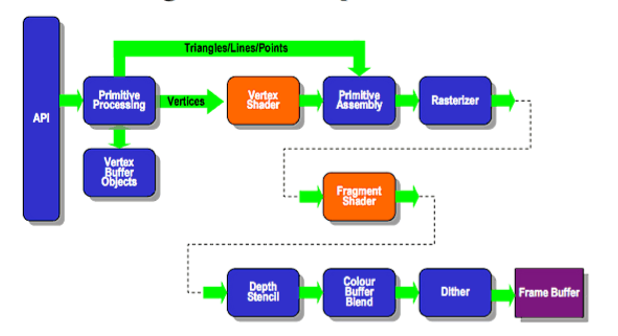
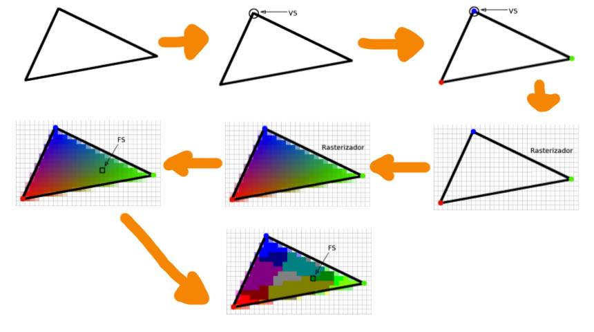
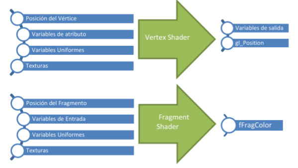
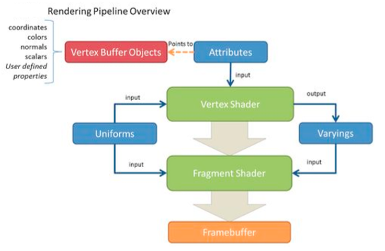

<style>
 blockquote{
     border-left-color: #00bbff;
 }
 .vscode-light h1, .vscode-light hr, .vscode-light table > tbody > tr + tr > td{
     border-color: #00bbff;
 }
</style>

# 5c. Introducción a la Programación de *Shaders* en *GPU*

## 1. Introducción
 Todo el procesamiento necesario para obtener una imagen a partir de un modelo requiere una gran cantidad de cálculo. Razonable que más pronto que tarde, y favorecido en gran medida por la evolución en la generación de gráficos por ordenador de la industria del video-juego, aparecieran unidades de procesamiento dedicadas a la generación de gráficos; lo que se conoce como *GPU (Graphics Processing Unit)*, que está integrada en una tarjeta junto con memoria y otra circuitería dando lugar a la Tarjeta Gráfica.

> De este modo, en una aplicación gráfica, la CPU se encarga de la gestión de la escena pero la visualización de la misma es una tarea que le corresponde a la GPU. La CPU se encarga de la lógica del juego, mientras el GPU se encarga de manejar vértices, normales, colores, triángulos... a través de programas shaders


## 2. El cauce de visualización
> La visualización, desde que se toma una malla de polígonos hasta que se asignan unos determinados colores en unas posiciones del *frame buffer* pasa por una serie de etapas encadenadas que es lo que se conoce como cauce de visualización (*rendering pipeline* en inglés).



Inicialmente ese cauce era un cauce fijo, no programable, contaba con unos parámetros y en función de los valores que se le dieran a dichos parámetros se podían tener diferentes tipos de visualizaciones, pero dentro del conjunto cerrado de visualizaciones que permitiera el cauce.

A partir de OpenGL2.0 el cauce tiene menos etapas pero dos de ellas son programables: el *vertex shader* y el *fragment shader*.

En el *vertex shader(VS)* se ejecuta un programa que toma como entrada vértices,tanto sus coordenadas como cualquier información que se asocie con los vértices .
 El *vertex shader* procesa esa información de entrada según el algoritmo que se haya programado y genera una salida, que después de un procesamiento fijo que produce **fragmentos** (píxeles),llega al programa que se ejecuta en el *fragment shader* (FS), el cual continúa con el procesamiento personalizado que se haya programado(ahora tomando como entrada información asociada a cada fragmento) hasta que, en última instancia, se genera la imagen en el *frame buffer*. (En las secciones 3 y 4 podrás ver con más detalle esta descripción).

 El uso de un cauce programable tiene, como todo, ventajas y desventajas. La ventaja ya se ha expuesto, se tiene la flexibilidad de realizar cualquier visualización que seamos capaces de programar. Y la desventaja, es que hay que programarlo.
Además, si hablamos de OpenGL ES 2.0 (OpenGL for Embedded Systems), que es el OpenGL que se diseñó para dispositivos móviles, videoconsolas, y dispositivos integrados en general, nos encontramos que no es compatible con versiones anteriores, de modo que sí o sí, hay que programar el cauce para poder visualizar.

## 3. Estructura de un programa *shader*
Un programa shader se escribe en `GLSL (OpenGL Shading Language)`, un lenguaje cuya sintaxis está inspirada en el lenguaje `C`.

 Para un *shader* se necesitan dos fuentes `GLSL`, uno para el *vertex shader* y otro para el *fragment shader*. El proceso de obtención de un programa *shader* a partir de los fuentes consiste en dos etapas: En una primera fase se compila cada archivo fuente obteniendo un archivo objeto por cada fuente. En una segunda etapa, se enlazan (*linkan*) todos los archivos objeto para obtener el programa *shader* que será ejecutado por la *GPU*.



### Explicación de las etapas fundamentales del cauce de visualización
En cada cara (un triángulo), el cauce seguiría este camino.

Primero, el ***vertex shader*** (VS) se ejecuta 3 veces para delimitar los vértices.<br>
El vertex shader se ejecuta para cada vértice y recibe la información que se haya asociado a dicho vértice, obligatoriamente sus coordenadas, y opcionalmente cualquier otra información que el programador considere necesaria para realizar la visualización que quiere hacer.

Toda esta información le llega al **rasterizador**, el cual trabaja sobre el triángulo conociendo de cada vértice del triángulo su posición proyectada y la información que ha calculado el VS.  También conoce la resolución de la imagen.<br>
El rasterizador realiza dos tareas, primero rasteriza (pixeliza) el triángulo obteniendo los píxeles (o *fragmentos*, ya que no se han dibujado todavía en pantalla) que van a formar parte del mismo cuando se visualice.<br>
Una segunda tarea del rasterizador, que también le podríamos llamar **interpolador** consiste en calcular qué información le corresponde a cada fragmento. Para ello, toma la información que ha recibido desde el VS de cada vértice del triángulo y por interpolación lineal calcula valores concretos para cada fragmento.

Ahora interviene el ***fragment shader*** (FS) que es llamado para cada fragmento, la información de entrada del FS es del mismo tipo que la información que era de salida en el VS  con los valores concretos de cada variable que el rasterizador/interpolador ha calculado entre medias.<br>
El FS es una etapa programable y puede realizar los cálculos que el programador quiera implementar para cada fragmento, aunque obligatoriamente debe proporcionar como salida el color del fragmento.

Finalmente se llega al **mezclador de fragmentos**. Esta tarea recibe todos los fragmentos calculados en las etapas anteriores para todos los triángulos de todas las mallas de polígonos en esa visualización (un renderizado completo).<br>
Para cada fragmento recibido conoce posición que tendrá en el frame buffer, el color calculado por el FS y la distancia del punto en la escena que ha generado dicho fragmento al plano de proyección de la vista para la que se está haciendo la visualización.<br>
En una escena dondehay varios objetos y unos objetos están por delante de otros desde el punto de vista del observador, al procesar dichas mallas de polígonos es de esperar que en una misma posición del frame buffer caigan varios fragmentos diferentes, procedentes de diversos objetos de la escena.<br>
El mezclador de fragmentos, para cada posición, toma todos los fragmentos que han caído ahí y mezcla sus colores según corresponda para obtener un color definitivo que será el que se envíe al frame buffer y termine siendo un píxel en la imagen, bien derivado de la mezcla de colores transparentes o bien el color opaco del objeto más cercano.


## 4. *Vertex* y *Fragment Shaders*



### 4.1 Flujo de datos en *Vertex* y *Fragment Shaders*
Las **variables de atributo** es la información asociada a cada vértice, toda aquella información, además de sus coordenadas, que el programador necesita de cada vértice para implementar el modelo de iluminación que ha diseñado. Obviamente, dado que es información específica de los vértices, solo entran en el *vertex shader*.

Las **variables uniformes** es la información que es constante para todos los triángulos de una misma malla de polígonos o incluso para toda la escena en esa visualización. Por ejemplo, información del material de esa malla, información sobre las luces de la escena, etc. Estas variables son de entrada tanto en el *vertex* como en el *fragment shader*.



Las **variables `varyings`** son las variables que se declaran como de salida en el *vertex shader* y como entrada en el *fragment shader*. El VS escribe en ellas la información que ha calculado para cada vértice. El *rasterizador/interpolador* las usa en su proceso de interpolación. Y el FS lee de ellas la información que le corresponde al fragmento que está procesando en esa ejecución del FS. Las variables `varyings` deben estar declaradas de igual forma en ambos *shaders*. Son la vía de comunicación entre ellos.


### 4.2 *Vertex shaders*
Se trata de un módulo que se ejecuta sobre cada vértice de la escena y que toma como información de entrada datos que son específicos de cada vértice, atributos, como pueden ser sus coordenadas (obligatorio), su vector normal, un color, etc.

También toma como datos de entrada aquellos que son comunes  y constantes para todos los vértices de una misma malla o de la propia escena(uniforms), como pueden ser información sobre el material de la malla, sobre la iluminación de la escena, sobre la vista, etc.

>¿Qué cálculos realiza? **Obligatoriamente** transformar el vértice según la vista, ya que debe proporcionar el vértice transformado como salida. Y ya, **opcionalmente**, operaciones relativas a modelos de iluminación como cálculo de normales o de coordenadas de texturas.

En cuanto a la información de salida que genera,obligatoriamente debe proporcionar el vértice transformado según la vista (gl_Position). Además proporcionará toda aquella información que ha calculado (varyings) y que es necesaria para que el *fragment shader* continúe con el cálculo del modelo de iluminación implementado.
### 4.3 Rasterizador / Interpolador
Se ejecuta para cada triángulo y recibe como entrada toda la información que ha generado el VS para cada vértice del triángulo (`gl_Position` y `varyings`).

Entonces genera todos los fragmentos que van a componer el triángulo que está procesando y para cada fragmento calcula el valor concreto que le corresponde a dichas variables.

La forma de calcular esos valores es mediante interpolación lineal. Primero se calculan los fragmentos que se sitúan en las aristas del triángulo, y después, línea a línea, se calculan todos los fragmentos del interior del triángulo por interpolación entre los fragmentos de los extremos de la línea. 

### 4.4 *Fragment shaders*
En cuanto al *fragment shader*,se ejecuta sobre cada fragmento tomando como entrada la información interpolada (`varyings`) que recibe del rasterizador/interpolador, y la información constante (`uniforms`).

>Su tarea es continuar con el cálculo del modelo de iluminación para en última instancia proporcionar el color definitivo del fragmento, siendo ese el dato obligatorio que tiene que proporcionar (`gl_FragColor`).

### 4.5 Parámetros de entrada/salida
#### `uniform`
Variables de entrada en ambos shaders. Son de **solo lectura**, constantes en todo el cauce de procesamiento de una primitiva. Pueden especificar valores como Matrices de transformación, Planos de recorte, Propiedades del material, Propiedades de las luces y Parámetros de efectos.
#### `attribute`
Son variables de entrada solo accesibles por el *vertex shader*, solo de lectura. Especifican información asociada a los vértices como Coordenadas, Color, Normal, Coordenadas de textura o Cualquier otro dato que se considere necesario.

#### `varying`
Son las variables con las que se pasa información entre ambos *shaders*. Están declaradas en los dos *shaders*, siendo de escritura/salida en el *vertex shader* y de lectura/entrada en el *fragment shader*.
Dichos tipos se indican al declarar las variables en cada shader.
### 4.6 Tipos de datos en `GLSL`
Se pueden usar tipos como `float`, `int`, `bool` con los operadores habituales.No obstante, `GLSL` incluye nuevos tipos vectoriales y matriciales muy útiles para los calculos que suele requerir la implementación de un modelo de iluminación, como son:

- Tuplas de 2,3 ó 4 enteros: `ivec2`, `ivec3`, `ivec4`
- Tuplas de 2,3 ó 4 reales: `vec2`, `vec3`, `vec4`
- Tuplas de 2,3 ó 4 booleanos vectoriales: `bvec2`, `bvec3`, `bvec4`
- Matrices cuadradas de reales: `mat2`, `mat3`, `mat4`
- Matrices no cuadradas de reales: `mat3x2`, etc.
  
Dichos tipos de datos vectoriales y matriciales tienen los operadores `+` y `*` sobrecargados y puede accederse a sus elementos tanto con el operador tradicional de corchetes (`color[0]`) como con nombres significativos (`color.r`).
Además, GLSL incluye funciones matemáticas como `abs`, `max`, `sqrt`, `pow`, `log`, `cos`, `normalize`, `dot`, `cross`, etc.


### 4.7 Variables
Hay convenciones al respecto:
`a_nombre`, atributo de vértice
`u_nombre`, variable `uniform`
`v_nombre`, salida del *vertex shader*, entrada del *fragment shader*
`f_nombre`, salida del *fragment shader*

También hay nombres que se usan habitualmente para ciertas variables, siendo prácticamente un estándar.
`a_vertex`, el vértice actual, en coordenadas del modelo
`a_normal`, la normal del vértice
`a_color`, el color del vértice

Ciertas variables `uniform`, también muy habituales, están disponibles en ambos *shaders*,
como:
`u_ModelViewMatrix`, la matriz de modelado y vista
`u_ProjectionMatrix`, la matriz de proyección
## 5. Ejemplos de *shaders*
> En este resumen se da una explicación de qué hacen los shaders para hacer tales cosas, los códigos podéis consultarlos en los apuntes originales
*Nota*: Tened en cuenta que los vectores normales han de ser **normalizados** cuando se interpolen las normales de los vértices en el *Fragment Shader*
### 5.1 Sombreado de *Gouraud*
La visualización con sombreado Gouraud, resumidamente, consiste en calcular el color en los vértices de los polígonos y obtener el coloreado del interior interpolando el color de los vértices.<br>
En este caso concreto, se debe calcular el color en los vértices (tarea del *vertex shader*) y dejar que el *rasterizador* interpole el color de los vértices para obtener el color en el interior. No se precisa de mucho tratamiento del *Fragment shader* ya que el trabajo lo han hecho en fases anteriores. Solo asigna el color al fragmento.
### 5.2 Sombreado de *Phong*
Este método, de manera resumida, lo que hace es calcular el color directamente, aplicando el modelo de iluminación, en todos los puntos de la superficie de los objetos, no solo en los vértices de los polígonos sino en todos los puntos. Para ello, necesita que todos los puntos donde vaya a calcular el color dispongan de su vector normal. Sin embargo al definir una geometría, solo se le da un vector normal a los vértices de los polígonos de la malla, el cual se puede hallar interpolando las normales de los vértices.

 El **VS** ahora hará muy poco trabajo además de transformar los vértices según la vista,y es tomar el vector normal que ha recibido como entrada para el vértice que está procesando y asignarlo a la salida.
El **rasterizador/interpolador** se encontrará esos vectores normales en los vértices de los polígonos y los interpolará para asignarle un vector normal a cada fragmento.
Entonces el ***fragment shader*** ya tiene lo que el sombreado de Phong requiere, el vector normal de cada fragmento para calcular el color de dicho fragmento de manera directa y no por estimación (interpolación) de otros colores.


### 5.3 Texturas
Para aplicar texturas difusas los shaders son cortos y fáciles. Si solo tenemos coordenadas de textura en los vértices del polígono y necesitamos coordenadas de textura en el interior para saber de qué parte de la textura (imagen) se debe tomar el color para dicho punto interior, que se sacan en el interpolador. 

El VS tendrá variables `varying` de salida para devolver la coordenada de textura del vértice que está procesando, el rasterizador/interpolador calculará las coordenadas de textura para cada fragmento, y el FS tendrá la misma variable `varying` de entrada para tomar las coordenadas de textura del fragmento y tomar el color de la textura para asignársela al fragmento.
### 5.4 Caso general
 Entonces, ¿dónde se programa principalmente el modelo de iluminación, en el vertex o en el fragment shader? **Depende**

 Para implementar un determinado modelo de iluminación, empecemos por el FS con la siguiente pregunta: *¿Qué necesito para calcular el color de un fragmento?*<br>
Hay 3 vías:
- Los datos necesarios son constantes por toda la malla. Los puedes obtener en variables `uniform` 
- Vienen del rasterizador/interpolador. Se deberá trabajar entonces con datos interpolados rovenientes de la salida del VS.
- Se calculan en el FS. Se planta de nuevo las dos alternativas anteriores.

En el *Vertex Shader* se haría un proceso similar: *¿Qué datos necesito para proporcionarle al rasterizador los datos que quiero hacerle llegar al FS?* Pueden obtenerse a partir de variables `uniform`, variables `attribute`, o calcularse a partir de variables `uniform` y `attribute`.

Una vez se haya hecho este análisis, ya se puede diseñar parte de la aplicación para proporcionar al cauce las variables `uniform` y `attribute` que se necesite. Habrá que diseñar el VS de manera que calcule toda aquella información que vaya a necesitar en el FS por interpolación. Y el FS para que con toda esa información que le hace llegar, calcule el color definitivo del fragmento.


## 6. Uso de *Shaders* en `Three.js`
### ¿Dónde pongo el código fuente de los *Shaders*?
El código fuente de los shaders irá en el archivo html entre etiquetas `<script></script>` y cuyo tipo sea `x−shader/x−vertex` si es un *Vertex shader*; o `x−shader/x−fragment` si es un *Fragment shader*, e instanciado por la `id` como se muestra en el siguiente ejemplo:
```html
<script type="x−shader/x−vertex" id="vertexS"> 
uniform float amplitude ;
attribute float displacement ; 
varying vec3 v_normal ; 
varying vec4 v_position ; 
 
 void main () { 
 vec3 newPosition = position + normal ∗ displacement ∗ amplitude ; 
 v_position = modelViewMatrix ∗ vec4 ( newPosition , 1.0); 
 gl_Position = projectionMatrix ∗ v_position ; 
 
 // Cálculo de la normal en coordenadas de vista 
 v_normal = normalize (vec3 ( normalMatrix ∗ normal )); 
 } 
</script>
```
### Variables `uniform` y `attribute` disponibles
#### Variables `uniform`
- `uniform mat4 modelMatrix;` Matriz de modelado
- `uniform mat4 viewMatrix;` Matriz de vista
- `uniform mat4 modelViewMatrix;` Matriz ModelView, composición de los dos anteriores
- `uniform mat4 projectionMatrix;` Matriz de proyección
- `uniform mat3 normalMatrix;` Matriz de transformación de normales
- `uniform vec3 cameraPosition;` Posición de la cámara
#### Variables `attribute`
- `attribute vec3 position;` Posición
-  `attribute vec3 normal;` Normales
-  `attribute vec2 uv;` Coordenadas de textura
-  `attribute vec3 color;` Color
### Definición de nuevas variables `uniform` 
Las variables uniform que hayamos declarado en los shaders deben declararse también en la aplicación `javascript` y se les debe dar un valor. Se realiza con la sintaxis que se ve en el siguiente código:

```javascript
// Declaración y definición
 uniformsCPU = { 
     amplitude:{ type:"f",value:1.0}
 };
// Se puede modificar cuando se desee 
uniformsCPU.amplitude.value = 2.5;
```
Solo hay que definir un diccionario en el que se declaran todas las variables uniform, con el mismo nombre, que se hayan declarado en los shaders. Se le da un tipo y un valor. El valor se puede cambiar en cualquier momento.

### Tipos de datos
|En GLSL|Tipo|Valor|
|-------|----|-----|
int|*i*|Un entero
float|*f*|Un real
vec2|*v2*|`THREE.Vector2`
vec3|*v3*|`THREE.Vector3`
vec3|*c*| `THREE.Color`
vec4|*v4*|`THREE.Vector4`
mat3|*m3*|`THREE.Matrix3`
mat4|*m4*|`THREE.Matrix4`
sampler2D|*t*|`THREE.Texture`
### Definición de nuevas variables `attribute`
Para la definición de nuevas variables `attribute` se requiere un poco más de trabajo, sobre todo porque cada vértice tiene su propio valor para una determinada variable attribute. En el siguiente ejemplo de código se muestra cómo hacerlo.

```javascript
 // Primero , se accede a los vértices de la geometría y se guarda en un vector auxiliar 
 // el valor que tendrá el atributo correspondiente para este vé rtice 
 var nVertices = model.geometry.attributes.position.count ; 
 var aux = new Float32Array ( nVertices ); 
 for ( var v = 0; v < nVertices ; v++) { 
     aux[v] = Math. random (); 
 } 
 // Los atributos se asignan a la geometría , que debe ser BufferGeometry 
 model.geometry.setAttribute ('displacement', new THREE. BufferAttribute (aux ,1)); 10 
 // Cuando se cambian atributos hay que solicitar una actualización 
 model.geometry.attributes.displacement.needsUpdate = true ;

```

### Creación del material
Ya solo queda crear el material con todo lo anterior y usarlo como cualquier otro material que ya viene con `Three`.

Para ello solo hay que instanciar la clase `ShaderMaterial` pasándole como parámetros todo lo anterior: las variables `uniform` y los códigos fuente del *vertex* y *fragment shader* (ahora es cuando se usa el `id` que se le dio en el `html` a dichos códigos fuente).

```javascript
var shaderMat = new THREE.ShaderMaterial ( {
     uniforms:uniformsCPU ,
      vertexShader:document.getElementById('vertexS').textContent ,
      fragmentShader:document.getElementById('fragmentS').textContent ,
      // Se le pueden poner otros campos opcionales 
      wireframe:true , // y se mostrar ía en modo alambre
      transparent:true , // obligatorio si se manejan transparencias
      lights:true // si se van a usar luces definidas en THREE 
      });

```

### Uso de luces en un *shader* personalizado
Las luces, dado que son las mismas para toda la escena en una visualización concreta, serán variables `uniforms` que hay que declarar adecuadamente tanto en el espacio CPU como en el espacio GPU.
#### En el espacio CPU
Al instanciar la clase `ShaderMaterial` espacio se debe poner el parámetro `lights` a `true`. También hay que añadir los uniforms de las luces a los `uniforms` que hayamos podido definir.
```javascript
var shaderMat = new THREE.ShaderMaterial ({ 
    // se mezclan los uniforms de las luces con otros que hayamos 
    // podido definir nosotros , en el ejemplo , amplitude 
    uniforms: THREE.UniformsUtils.merge ([ THREE.UniformsLib ['lights'] ,
        {
          amplitude: {type :'f', value: 5.0 } 
          
        }
    ]) ,
    vertexShader: document.getElementById ('vertexS').textContent ,
    fragmentShader: document.getElementById ('fragmentS').textContent , 
    // se activa el atributo lights 
    lights: true });
```
#### En el espacio GPU
Hay que añadir la declaración de estructuras que recojan todos los parámetros de los diferentes tipos de luces. También hay que declarar arrays de elementos de dichas estructuras que alojarán las diferentes luces usadas en la escena.

